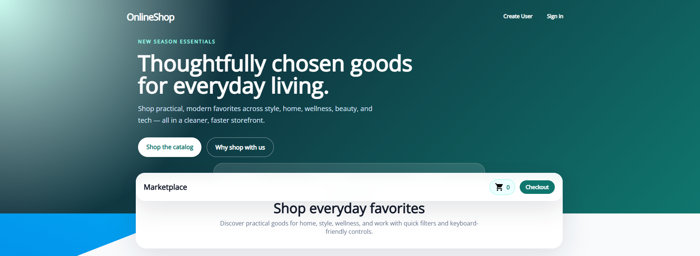
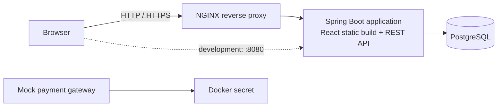

# OnlineShop



OnlineShop is a full-stack demonstration storefront packaged as a multi-container
Docker application. Customers can browse products, manage a cart and wish list,
create an account, sign in, maintain their profile, review previous orders, leave
product reviews, and complete a simulated checkout.

> [!IMPORTANT]
> This repository is a learning and demonstration project. Its bundled credentials,
> certificates, plain-text passwords, JWT signing key, and mock payment service are
> **not suitable for production use**.

## Features

- Product catalogue with category and product-detail views
- Cart quantity controls, removal, totals, and checkout validation
- Account creation and email- or phone-based sign-in
- JWT-authenticated checkout, profile editing, order history, and wish lists
- Product ratings and comments
- PostgreSQL-backed customers, orders, products, comments, and wish-list items
- Seeded demo catalogue
- NGINX TLS termination and reverse proxying
- Simulated payment-gateway container
- Backend and frontend automated tests

## Architecture



The production-style Compose stack contains four services:

| Service | Purpose | Exposed ports |
| --- | --- | --- |
| `reverse_proxy` | Redirects HTTP to HTTPS and proxies traffic to the app | `80`, `443` |
| `appserver` | Serves the compiled React client and Spring REST API | `8080`; `5005` is reserved for debugging |
| `database` | Stores application data and loads the seed catalogue | `5432` |
| `payment_gateway` | Simulates authentication against a payment token | None |

The application image is a multi-stage build: Node compiles the React client,
Maven packages the Spring Boot service, and an Eclipse Temurin Java 8 runtime runs
the combined result.

## Technology

- **Frontend:** React 15, Redux, React Router, Material UI, Redux Form
- **Backend:** Java 8, Spring Boot 1.5, Spring MVC, Spring Data JPA, Spring Security
- **Data:** PostgreSQL in Docker; H2 for the default/local Spring profile
- **Authentication:** JSON Web Tokens (JWT)
- **Infrastructure:** Docker Compose, NGINX, Docker secrets
- **Testing:** JUnit, Spring Boot Test, Mockito, REST Assured, Jest, and Enzyme

## Prerequisites

For the recommended setup, install:

- Docker Engine with BuildKit support
- Docker Compose v2 (`docker compose`)
- OpenSSL only if you want to replace the bundled development certificate

The first build downloads the base images plus npm and Maven dependencies, so it
can take several minutes.

## Quick start

1. Clone the repository and enter it:

   ```bash
   git clone https://github.com/amirreza-hamzeh/OnlineShop.git
   cd OnlineShop
   ```

2. Build and start the complete stack:

   ```bash
   docker compose up --build
   ```

3. Open one of the following URLs:

   - `https://localhost/` — through NGINX (accept the warning for the bundled
     self-signed development certificate)
   - `http://localhost:8080/` — directly from the application server

4. Stop the stack with <kbd>Ctrl</kbd>+<kbd>C</kbd>, then remove its containers and
   network:

   ```bash
   docker compose down
   ```

To reset PostgreSQL data as well, remove the Compose volumes:

```bash
docker compose down --volumes
```

## Using the storefront

The catalogue can be browsed without an account. Create an account from **Sign
Up**, then sign in with the email address or phone number and password supplied
during registration. Authentication unlocks:

- Checkout and order creation
- Saved profile and shipping details
- Order history
- Wish-list management

The payment gateway is intentionally a simulator: it validates the development
token and logs that it is waiting for transactions; it does not contact a real
payment processor or charge a card.

## Development

### Run backend tests

From the repository root:

```bash
cd app
mvn test
```

The default Spring profile uses an H2 database for local and test execution.

### Run frontend tests

```bash
cd app/react-app
npm install
CI=true npm test -- --runInBand
```

### Run the frontend development server

Start the Spring application on port `8080`, then run:

```bash
cd app/react-app
npm install
npm start
```

The React development server proxies API requests to `http://localhost:8080`.

### Debug Compose setup

An alternate Compose definition builds `app/Dockerfile-dev` and exposes Java
debug port `5005`:

```bash
docker compose -f docker-compose-dev.yml up --build
```

That image starts the JVM with `suspend=y`, so the application waits until a
remote debugger attaches to port `5005`.

## Configuration and secrets

The main stack reads local development secrets from `devsecrets/` and mounts them
into containers as Docker Compose secrets:

| Secret | Consumer | Development purpose |
| --- | --- | --- |
| `postgres_password` | PostgreSQL and app server | Database authentication |
| `payment_token` | Payment gateway | Selects the simulated gateway mode |
| `revprox_cert` | NGINX | TLS certificate |
| `revprox_key` | NGINX | TLS private key |

Spring datasource settings live in `app/src/main/resources/application.yml`.
Available profiles include `local`/`default` (H2), `postgres`, `mysql`, and
`sqlserver`; the main application container activates `postgres`.

To use a replacement local certificate:

```bash
openssl req -x509 -nodes -newkey rsa:4096 -sha256 -days 365 \
  -keyout reverse_proxy/domain.key \
  -out reverse_proxy/domain.crt
```

For any real deployment, use an external secret manager, rotate every credential,
provide a trusted certificate, hash passwords, replace the hard-coded JWT key, and
connect to an actual payment provider.

## API overview

The browser client communicates with these principal endpoint groups:

| Area | Endpoints |
| --- | --- |
| Products and reviews | `/api/product/`, `/api/product/{id}`, `/api/product/{id}/comments` |
| Accounts and profile | `/api/customer/`, `/api/profile` |
| Authentication | `/login/` |
| Orders | `/api/order/`, `/api/profile/orders` |
| Wish list | `/api/wishlist`, `/api/wishlist/product/{id}` |
| Purchase confirmation | `/purchase/` |
| Diagnostics | `/utility/healthcheck/`, `/utility/containerid/` |

Authenticated calls send the token returned by `/login/` as
`Authorization: Bearer <token>`. See [`REST.md`](REST.md) for the legacy detailed
request examples; when it differs from the running application, the controllers
under `app/src/main/java/com/docker/onlineshop/controller/` are authoritative.

## Project layout

```text
.
├── app/                    # Spring Boot service and React client
│   ├── react-app/          # Storefront source and frontend tests
│   └── src/                # Java source, configuration, and backend tests
├── database/               # PostgreSQL image configuration and seed SQL
├── devsecrets/             # Local-only Compose secret values
├── payment_gateway/        # Mock gateway container
├── reverse_proxy/          # NGINX configuration and development TLS files
├── windows/                # Windows-container variant and instructions
├── docker-compose.yml      # Main Linux-container stack
├── docker-compose-dev.yml  # JVM remote-debug stack
└── docker-stack.yml        # Docker Swarm stack definition
```

For the Windows-container implementation, see [`windows/README.md`](windows/README.md).

## Troubleshooting

- **The HTTPS page shows a certificate warning:** expected for the bundled
  self-signed development certificate. Use the direct `http://localhost:8080/`
  URL or install a locally trusted replacement certificate.
- **Port already allocated:** stop the process using ports `80`, `443`, `5432`,
  `8080`, or `5005`, or change the host-side mapping in the Compose file.
- **The database has stale seed data:** run `docker compose down --volumes`, then
  rebuild and start the stack.
- **The debug stack never serves the site:** attach a remote Java debugger to
  port `5005`; the debug JVM intentionally starts suspended.
- **A build does not recognize `RUN --mount=type=cache`:** enable BuildKit or
  update Docker to a current release.

## Attribution

OnlineShop is based on the
[dockersamples/atsea-sample-shop-app](https://github.com/dockersamples/atsea-sample-shop-app)
project originally developed by Docker, Inc.

The original project is licensed under the Apache License, Version 2.0.

This repository contains modifications and additional functionality
developed by Amirreza Hamzeh, including changes to the user interface,
application functionality, configuration, and deployment.

Original work:
Copyright 2016 Docker, Inc.

Modifications:
Copyright 2026 Amirreza Hamzeh

## License

This project is distributed under the terms in [`LICENSE`](LICENSE).
